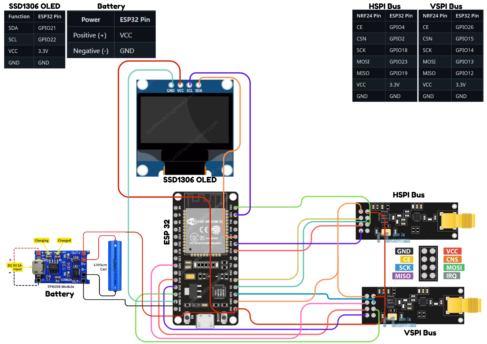

# 📡 SpiritBox: BLE & RF Jammer Project 📡


<p align="center">
  
</p>

## ⚠️ Educational Purpose Only

This project is designed **strictly for educational and research purposes** to demonstrate RF security concepts and the vulnerabilities in wireless communications. Using this device for disrupting legitimate communications is illegal in most jurisdictions.

## 🌟 Overview

SpiritBox is an advanced BLE (Bluetooth Low Energy) and RF jammer built on the ESP32 platform with NRF24L01 modules. It leverages dual SPI bus architecture to efficiently target multiple frequency channels simultaneously, providing a comprehensive platform for wireless security research and testing.

## 🚀 Key Features

- **📶 Dual Radio Operation**: Utilizes two NRF24L01 modules operating on separate SPI buses
- **🔄 Dynamic Channel Hopping**: Implements both sequential and random channel selection algorithms
- **📊 Real-time Monitoring**: OLED display shows current operational status and parameters
- **🔀 Mode Selection**: Hardware switch to toggle between different jamming patterns
- **🔋 Low Power Design**: Optimized for extended field operation with battery power
- **📱 Portable Form Factor**: Compact design for ease of deployment in laboratory environments

## 🛠️ Hardware Requirements

| Component | Quantity | Purpose |
|-----------|----------|---------|
| 🧠 ESP32 Dev Board | 1 | Main controller |
| 📡 NRF24L01+ Modules | 2 | RF transmission |
| 📺 SSD1306 OLED (128x32) | 1 | Status display |
| 🔘 Toggle Switch | 1 | Mode selection |
| ⚡ 3.3V Voltage Regulator | 1 | Power stabilization |
| 🔋 18650 Battery Holder | 1 | Power source |
| 🔌 Capacitors (10μF) | 2 | Power filtering |

## 📊 Wiring Diagram

<p align="center">
  
</p>

## 💻 Software Dependencies

- 🔧 Arduino IDE (1.8.x or later)
- 🧩 ESP32 Arduino Core
- 📚 Libraries:
  - RF24 (by TMRh20)
  - Adafruit GFX
  - Adafruit SSD1306
  - ezButton

## ⚡ Installation

1. Install the Arduino IDE and ESP32 board support
2. Install required libraries through the Library Manager
3. Clone this repository:
   ```
   git clone https://github.com/rubberpirate/spiritbox.git
   ```
4. Open the project in Arduino IDE
5. Select "ESP32 Dev Module" from the Board menu
6. Upload the sketch to your ESP32

<p align="center">
  
</p>

## 🎮 Operation Modes

### 🔄 Sequential Hopping Mode
- Systematically sweeps through the 2.4GHz band
- Predictable pattern for controlled testing
- Configurable delay between channel switches

### 🎲 Random Hopping Mode
- Unpredictable channel selection algorithm
- Variable timing between transmissions
- More effective against adaptive frequency-hopping systems

## 📺 OLED Interface

<p align="center">
  
</p>

The OLED display shows:
- Current operating mode
- Active channels for both radios
- Transmission status
- Power level indicator

## ⚙️ Configuration Options

The following parameters can be modified in the code:

```cpp
// Channel range (0-125)
#define MIN_CHANNEL 0
#define MAX_CHANNEL 83

// Power level (RF24_PA_MIN, RF24_PA_LOW, RF24_PA_HIGH, RF24_PA_MAX)
#define POWER_LEVEL RF24_PA_HIGH

// Transmission speed (RF24_250KBPS, RF24_1MBPS, RF24_2MBPS)
#define DATA_RATE RF24_1MBPS
```

## 📈 Performance Considerations

- **🔋 Battery Life**: Approximately 3-4 hours with an 18650 battery
- **📡 Effective Range**: 10-15 meters with standard antenna
- **📶 Channel Coverage**: Up to 84 channels in the 2.4GHz spectrum
- **⚡ Response Time**: ~0.5ms channel switching speed


## 🔮 Future Enhancements

- 🌐 WebSocket interface for remote control
- 🧠 Enhanced pattern recognition for targeted jamming
- 📊 Spectrum analyzer functionality

## ❓ Troubleshooting

| Issue | Solution |
|-------|----------|
| 📡 NRF modules not responding | Check SPI connections and power supply stability |
| 📶 Limited range | Verify antenna connection, try using an external antenna |
| 🔄 Inconsistent operation | Add additional capacitors (10μF) near NRF power pins |
| 🧠 ESP32 crashes | Reduce SPI speed or add delay between operations |

## 🤝 Contributing

Contributions to this educational project are welcome. Please open an issue or submit a pull request with your improvements.


---

*✨ Remember: With great power comes great responsibility. Use this knowledge ethically. ✨*
